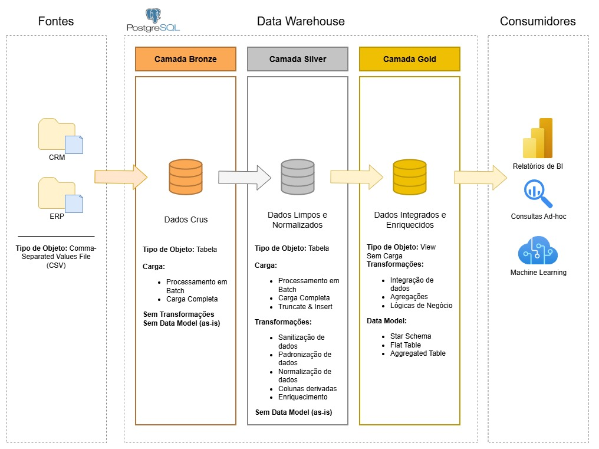
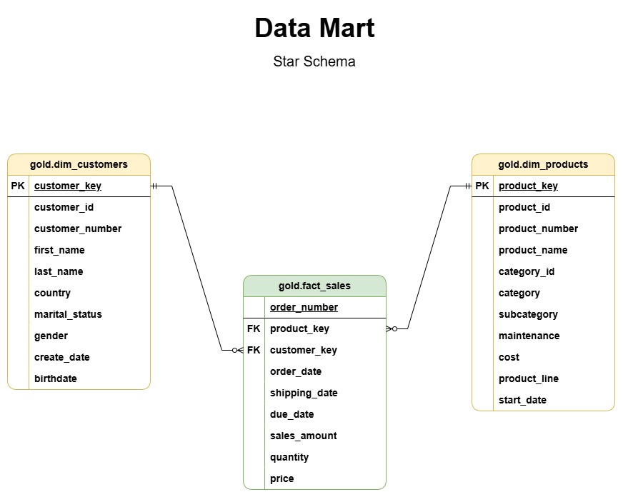
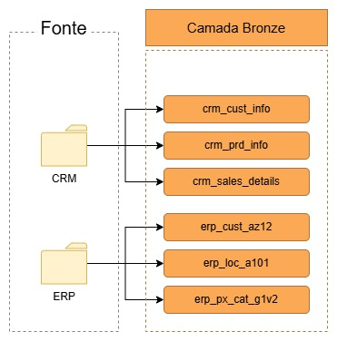

# Visão Geral

O projeto CRM/ERP Data Warehouse é uma solução abrangente de data warehouse projetada para integrar, armazenar e analisar dados provenientes de sistemas CRM (Customer Relationship Management) e ERP (Enterprise Resource Planning). Este repositório contém scripts SQL para a criação de tabelas dimensionais e fatos, bem como consultas exploratórias para análise de dados.

## Estrutura do Repositório
- `datasets/`: Contém conjuntos de dados de exemplo usados para popular o data warehouse.
    - `source_crm/`: Dados relacionados ao sistema CRM.
    - `source_erp/`: Dados relacionados ao sistema ERP.
- `docs/`: Documentação relacionada ao projeto, incluindo diagramas de arquitetura e guias
- `drawio/`: Arquivos do Draw.io para diagramas de banco de dados e fluxos de dados.
- `image/`: Imagens usadas na documentação.
- `sql/`: Contém todos os scripts SQL organizados em subdiretórios.
  - `build/`: Scripts para criar tabelas dimensionais e fatos.
  - `exploration/`: Consultas SQL para explorar e analisar os dados no data warehouse.
- `tests/`: Scripts de teste para validar a integridade e qualidade dos dados e a funcionalidade do data warehouse.

## Arquitetura do Data Warehouse

### Arquitetura Medallion

A arquitetura Medallion é uma abordagem em camadas para organizar dados em um data warehouse, garantindo qualidade e governança dos dados. As camadas principais são: Bronze, Prata e Ouro.

1. **Camada Bronze**: Esta é a camada de ingestão bruta onde os dados são coletados diretamente das fontes, como sistemas CRM e ERP. Os dados nesta camada são armazenados em seu formato original, sem transformações significativas. O objetivo é capturar todos os dados para garantir que nenhuma informação seja perdida.
2. **Camada Prata**: Nesta camada, os dados da camada Bronze são limpos, transformados e organizados. Isso pode incluir a remoção de duplicatas, tratamento de valores ausentes e padronização de formatos. A camada Prata serve como uma fonte confiável de dados para análises mais detalhadas.
3. **Camada Ouro**: A camada Ouro é onde os dados são otimizados para análises e relatórios. Nesta camada, os dados são agregados, sumarizados e estruturados em tabelas dimensionais e fatos, facilitando consultas rápidas e eficientes. A camada Ouro é projetada para atender às necessidades específicas de negócios e análises avançadas.

### Modelagem Dimensional (Star Schema)

O data warehouse utiliza um modelo dimensional em estrela (Star Schema) para organizar os dados de forma eficiente para consultas analíticas. O modelo consiste em tabelas de fatos e tabelas dimensionais.

- **gold.dim_customers**: Tabela dimensional que armazena informações sobre os clientes, como nome, localização e dados demográficos.
- **gold.dim_products**: Tabela dimensional que contém detalhes sobre os produtos, incluindo categorias e descrições.
- **gold.fact_sales**: Tabela fato que registra transações de vendas, conectando dimensões como clientes, produtos e tempo para análises detalhadas.

## Dataflow entre as camadas

A imagem abaixo ilustra o fluxo de dados entre as diferentes camadas do data warehouse, desde a ingestão dos dados brutos até a disponibilização para análises e relatórios.

